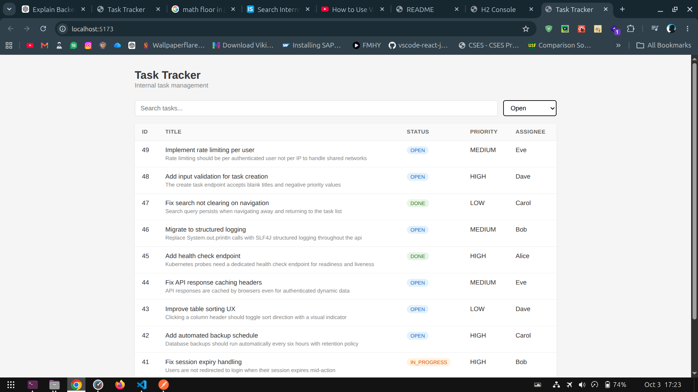
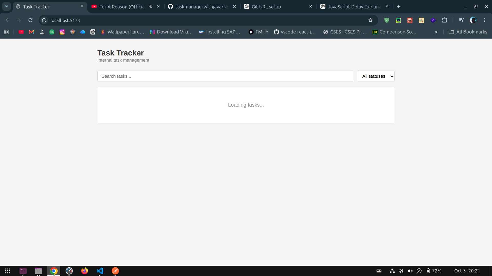
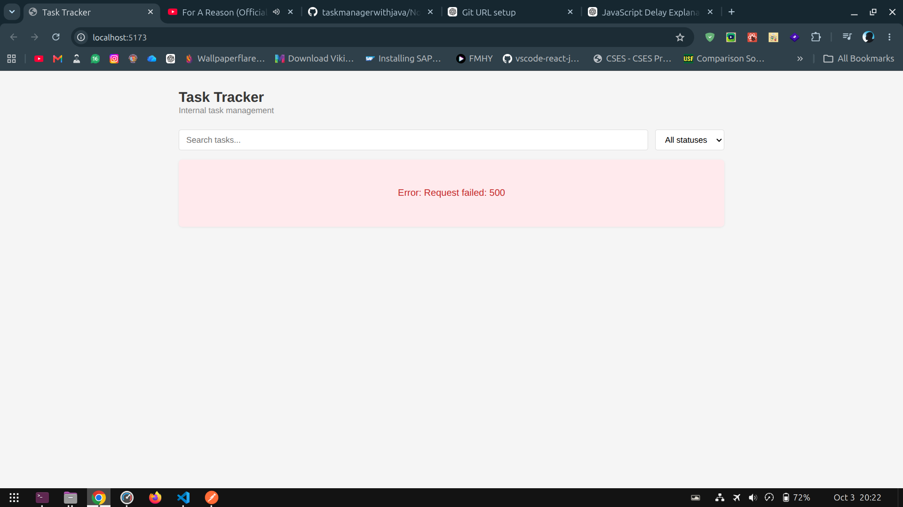

# Technical Exercise Notes

## 1. Approach

I first read the README and set up the application locally.

I then:

- Ran the backend and frontend.
- Tested the main application features from the UI.
- Checked API requests and responses.
- Reviewed the relevant frontend and backend code.
- Prioritized issues based on their functional impact.
- Fixed the highest-value issues first.
- Retested the affected functionality after each fix.

---

## 2. My System's Environment

- Frontend: React
- Backend: Spring Boot
- Database: H2
- Java version: 21
- Node.js version: 24
- npm version: 11.19

---

## 3. Issues Found and Fixed

### Issue 1: Filter control

**Problem:**

The filter functionality was not returning the data in the expected filtered manner.



**How I found it:**

I first performed a sanity check of the filter functionality and noticed that the results were not being filtered correctly. I then inspected the API request and confirmed that the frontend was sending the correct filter data. After checking the API response, I found that the returned data was not being filtered correctly.

**Root cause:**

The issue was in the SQL `WHERE` condition used by the backend. The search conditions for `title` and `description` were combined with `AND` and `OR` without proper parentheses. Because SQL evaluates `AND` before `OR`, the status filter was not being applied consistently to all search results.

**Fix:**

I updated the SQL query by grouping the `title` and `description` search conditions inside parentheses and applying the status filter separately.

```sql
SELECT * FROM tasks
WHERE archived = FALSE
  AND (
      LOWER(title) LIKE :term
      OR LOWER(description) LIKE :term
  )
  AND (:status IS NULL OR LOWER(status) = LOWER(:status))
ORDER BY created_at DESC
```

This ensures that the task must be non-archived, must match the search term in either the title or description, and must also match the selected status when a status filter is provided.

**Why this fix:**

I used parentheses to explicitly control the logical order of the SQL conditions. This prevents the `OR` condition from bypassing the other filters and ensures that the status filter is consistently applied to the complete search condition.

**Verification:**

I tested the filter with different combinations of search terms and statuses. I verified that selecting a specific status returned only tasks with that status, while leaving the status filter empty returned tasks matching the search term regardless of status.

---

### Issue 2: Unnecessary API Delay

**Problem:**

The application felt slow during normal operations, particularly while searching and filtering. The delay was noticeable even when no search query was provided.

**How I found it:**

During the sanity check, I tested the search and filter functionality and noticed that the application was taking longer than expected to respond. I also observed that the delay was present even when no search query was provided.

I checked the API flow and found that an artificial delay was being introduced in the backend using `Thread.sleep()`. The delay was based on the query length and was being executed even when there was no meaningful search query.

**Root Cause:**

The backend contained logic that intentionally delayed request processing based on the query length:

```java
int complexityScore = Math.max(0, 10 - query.length());

long queryWeight = complexityScore * 100L;

try {
    Thread.sleep(queryWeight);
} catch (InterruptedException e) {
    Thread.currentThread().interrupt();
}
```

For shorter queries, the calculated delay was larger. When the query was empty, the delay could also be applied, resulting in unnecessary waiting.

**Initial Fix Attempt:**

Initially, I modified the backend code by adding a condition to perform the search-related delay only when a valid search query was provided:

```java
if (query != null && !query.trim().isEmpty()) {

    int complexityScore = Math.max(0, 10 - query.length());

    long queryWeight = complexityScore * 100L;

    try {
        Thread.sleep(queryWeight);
    } catch (InterruptedException e) {
        Thread.currentThread().interrupt();
    }
}
```

This prevented the artificial search delay from being applied when the search query was empty.

**Change in Approach:**

After reviewing the issue again, I understood that the backend delay was intentionally present as part of the exercise and should not be removed or modified. Therefore, I reverted my backend changes and restored the original backend behavior.

Instead of modifying the backend, I addressed the unnecessary API requests from the frontend.

**Final Fix:**

I added **debouncing** to the React frontend using Lodash.

Previously, every change in the search query could trigger an API request. For example, when searching for `Java`, requests could be triggered for:

```text
J
Ja
Jav
Java
```

I added a 500ms debounce so that the API request is made only after the user stops typing.

```js
const debouncedFunction = _.debounce(callfunction, 500);

debouncedFunction();

return () => {
  debouncedFunction.cancel();
};
```

This allows the existing backend delay to remain unchanged while reducing unnecessary API calls from the frontend.

**Why this fix:**

The backend behavior was intentionally kept unchanged. Debouncing is applied on the frontend because it prevents multiple API requests from being sent while the user is continuously typing.

This reduces unnecessary API calls and improves the search experience without modifying the existing backend processing logic.

**Verification:**

I first verified the issue by testing the application with an empty query and different search inputs. I initially modified the backend to skip the delay for an empty query, but after understanding the intended behavior, I reverted those backend changes.

I then implemented debouncing in the React frontend and tested the search functionality again. I confirmed that the backend delay remains as originally implemented, while the frontend now waits for the user to stop typing before making the API request.

---

### Issue 3: Loading state not reset on API error

**Problem:**

When the API request failed with a `500 Internal Server Error`, the loading state was not changing back to `false`.


**How I found it:**

I checked the API response and found that the request returned status `500`. I then checked the `.catch()` block in the `useTasks` hook.

**Root cause:**

`setLoading(false)` was only called inside `.then()`, so it was never executed when the request failed.

**Fix:**

Added `setLoading(false)` inside the `.catch()` block.


**Why this fix:**

It ensures that the loading state is stopped even when the API request fails.

**Verification:**

Tested with a `500` API response and confirmed that the error was caught and the loading state changed to `false`.

---

### Issue 4: Filter and Search Pagination Reset

**Problem:**

When changing the status filter or search query, the results were not displayed from the first page.

**How I found it:**

I tested the status filter and search functionality and noticed that the page number was not resetting to 1 when the status or search query changed. As a result, the searched keyword might not be found on the current page, causing unexpected pagination behavior when navigating between pages. This issue could only be resolved by clearing the entire search query.

**Root cause:**

The page state was not being reset when the status filter or query changed. This caused the application to request a page that might not exist for the new filtered results.

**Fix:**

Added a useEffect to reset the page number to 1 whenever the status or search query changes.

useEffect(() => {
setPage(1);
}, [status, query]);

**Why this fix:**

When the status filter or search query changes, the number of available results and pages can also change. Resetting the page to 1 ensures that the user starts from the first page of the updated results.

**Verification:**

Tested by changing the status from All to Done and by changing the search query. In both cases, the page number automatically resets to 1, and the correct filtered or searched results are displayed.

---

## 4. Improvements

### Improvement 1: Table Header Hover Feedback

**Problem / Opportunity:**

The table headers did not provide clear visual feedback when the user hovered over them, even though the headers were clickable for sorting.

**Change:**

Added a bold font style to the table header text when the user hovers over the `<thead>`.

**Reason:**

The hover effect provides visual feedback that the table headers are interactive and can be clicked to sort the tasks.

**Verification:**

Hovered over each table header and verified that the header text becomes bold. Also confirmed that the styling returns to normal when the cursor moves away from the header.

---

### Improvement 2: Task Table Sorting

**Problem / Opportunity:**

The task table did not provide sorting functionality, making it difficult to organize and find tasks based on specific columns.

**Change:**

Added column-based sorting for **ID, Title, Status, Priority, and Assignee**. Users can click a column header to sort the tasks in ascending or descending order. An arrow icon is displayed on the currently selected column to indicate the sorting direction.

**Reason:**

Sorting makes it easier to organize and locate tasks based on different fields. The sorting direction indicator also helps users understand the current sort order.

**Verification:**

Tested each table header by clicking it and verifying that the tasks were sorted according to the selected column. Clicking the same column again was tested to confirm that the sorting direction changes between ascending and descending. Also verified that the sorting arrow appears only on the currently selected column.

---

### Improvement 3: Loading Indicator

**Problem / Opportunity:**

The application displayed only the text "Loading tasks..." while task data was being fetched. This provided limited visual feedback to the user.

**Change:**

Added a spinner icon using `PiSpinnerBallFill` alongside the loading message and applied a spinning animation to the icon.

**Reason:**

The spinner provides clear visual feedback that the application is actively processing the request and that the task data is still being loaded.

**Verification:**

Tested the component with the `loading` state set to `true` and verified that the spinner and "Loading tasks..." message were displayed. Also verified that the loading state disappears once the task data is available.

---

### Improvement 4: Status and Priority Icons

**Problem / Opportunity:**

The Status and Priority columns displayed task information with limited visual distinction, making it less convenient to identify the status or priority at a glance.

**Change:**

Added meaningful icons to the **Status** and **Priority** columns.

- Added different icons for each status:
  - **Open** → File icon
  - **In Progress** → Pending actions icon
  - **Done** → Check-circle icon

- Added an alert icon for each priority:
  - **High** → Red alert icon
  - **Medium** → Orange alert icon
  - **Low** → Default alert icon

**Reason:**

The icons provide quick visual identification of a task's status and priority, making the table easier to scan and improving overall readability.

**Verification:**

Tested the component with different task statuses and priorities and verified that the appropriate icons are displayed for each value. Also verified that the status and priority tooltips display the corresponding text when hovering over the icons.

---

## 5. Assumptions

- I treated the existing application behavior described in the README as the intended behavior unless there was clear evidence of a defect.
- I prioritized functional and high-impact issues over minor cosmetic changes.
- I avoided unnecessary architectural changes.
- I kept the existing application structure where possible.
- I tested changes locally before considering them complete.
- I have assumed that the provided SQL given in query is correct and no changes required.
