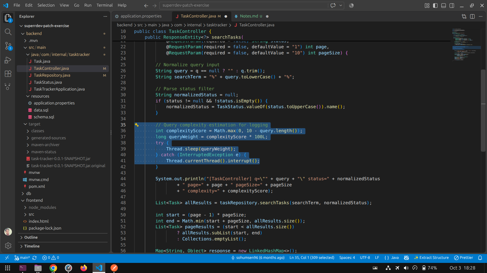

# Technical Exercise Notes

## 1. Approach

I first read the README and set up the application locally.

I then:

- Ran the backend and frontend.
- Tested the main application features from the UI.
- Checked API requests and responses.
- Reviewed the relevant frontend and backend code.
- Prioritized issues based on their functional impact.
- Fixed the highest-value issues first.
- Retested the affected functionality after each fix.

---

## 2. My System's Environment

- Frontend: React
- Backend: Spring Boot
- Database: H2
- Java version: 21
- Node.js version: 24
- npm version: 11.19

---

## 3. Issues Found and Fixed

### Issue 1: Filter control

**Problem:**

The filter functionality was not returning the data in the expected filtered manner.


**How I found it:**

I first performed a sanity check of the filter functionality and noticed that the results were not being filtered correctly. I then inspected the API request and confirmed that the frontend was sending the correct filter data. After checking the API response, I found that the returned data was not being filtered correctly.

**Root cause:**

The issue was in the SQL `WHERE` condition used by the backend. The search conditions for `title` and `description` were combined with `AND` and `OR` without proper parentheses. Because SQL evaluates `AND` before `OR`, the status filter was not being applied consistently to all search results.

**Fix:**

I updated the SQL query by grouping the `title` and `description` search conditions inside parentheses and applying the status filter separately.

```sql
SELECT * FROM tasks
WHERE archived = FALSE
  AND (
      LOWER(title) LIKE :term
      OR LOWER(description) LIKE :term
  )
  AND (:status IS NULL OR LOWER(status) = LOWER(:status))
ORDER BY created_at DESC
```

This ensures that the task must be non-archived, must match the search term in either the title or description, and must also match the selected status when a status filter is provided.

**Why this fix:**

I used parentheses to explicitly control the logical order of the SQL conditions. This prevents the `OR` condition from bypassing the other filters and ensures that the status filter is consistently applied to the complete search condition.

**Verification:**

I tested the filter with different combinations of search terms and statuses. I verified that selecting a specific status returned only tasks with that status, while leaving the status filter empty returned tasks matching the search term regardless of status. I also verified that archived tasks were excluded from the results.

---

### Issue 2: Unnecessary API Delay

**Problem:**

The application felt slow during normal operations, particularly while searching and filtering. The delay was noticeable even when no search query was provided.

**How I found it:**

During the sanity check, I noticed that search and filter operations were taking longer than expected. I also observed that the application could feel slow during normal operations even when no search was being performed.

I checked the API flow and found that an artificial delay was being introduced in the backend. The delay was based on the query length and was executed regardless of whether a search query was actually provided.

**Root Cause:**

The backend contained the following logic:



This intentionally blocks the request-processing thread using `Thread.sleep()`. For shorter queries, the calculated delay is larger. More importantly, the delay is also applied when there is no meaningful search query, causing unnecessary waiting and making the application feel sluggish.

**Fix:**

I added a condition so that the search-related delay/processing is performed only when a valid search query is provided. When the query is empty or not provided, the application skips the search-specific processing and proceeds directly to the next step.

For example:

```java
if (query != null && !query.trim().isEmpty()) {
    int complexityScore = Math.max(0, 10 - query.length());
    long queryWeight = complexityScore * 100L;

    try {
        Thread.sleep(queryWeight);
    } catch (InterruptedException e) {
        Thread.currentThread().interrupt();
    }
}
```

**Why this fix:**

There is no reason to perform search-specific processing when the user has not entered a search query. Skipping this unnecessary processing reduces the response delay for normal requests while preserving the existing search behavior.

**Verification:**

I tested the application with an empty search query and with an actual search query. The application no longer introduces the unnecessary search delay when no search term is provided, while search functionality continues to work as expected.

---

### Issue 3: [Short issue title]

**Problem:**
[Describe what was wrong.]

**How I found it:**
[Describe how you identified the issue.]

**Root cause:**
[Explain the root cause.]

**Fix:**
[Explain what you changed.]

**Why this fix:**
[Explain why you chose this solution.]

**Verification:**
[Explain how you tested the fix.]

---

## 4. Improvements

### Improvement 1: [Short title]

**Problem / Opportunity:**
[Describe what could be improved.]

**Change:**
[Describe what you changed.]

**Reason:**
[Explain why the change provides value.]

**Verification:**
[Explain how you tested the improvement.]

---

### Improvement 2: [Short title]

**Problem / Opportunity:**
[Describe what could be improved.]

**Change:**
[Describe what you changed.]

**Reason:**
[Explain why the change provides value.]

**Verification:**
[Explain how you tested the improvement.]

---

## 5. Assumptions

- I treated the existing application behavior described in the README as the intended behavior unless there was clear evidence of a defect.
- I prioritized functional and high-impact issues over minor cosmetic changes.
- I avoided unnecessary architectural changes.
- I kept the existing application structure where possible.
- I tested changes locally before considering them complete.
- Any additional assumptions made during implementation are documented below.

### Additional Assumptions

- [Add assumption here if required.]
- [Add assumption here if required.]

---

## 6. Testing

After making the changes, I tested:

- [ ] Application startup
- [ ] Frontend application loading
- [ ] Backend application startup
- [ ] Main frontend functionality
- [ ] Main API endpoints
- [ ] Create operation
- [ ] Update operation
- [ ] Delete operation
- [ ] Search functionality
- [ ] Filter functionality
- [ ] Input validation
- [ ] Error handling
- [ ] Database behavior
- [ ] Loading states
- [ ] Empty states
- [ ] Regression testing of existing functionality

---

## 7. Files Changed

The main files changed during the exercise are listed below.

### Frontend

- `[file path]` — [brief description of the change]
- `[file path]` — [brief description of the change]

### Backend

- `[file path]` — [brief description of the change]
- `[file path]` — [brief description of the change]

### Other

- `NOTES.md` — documented findings, fixes, assumptions, and testing.
- `handwritten/` — handwritten explanations of the findings and changes.

---

## 8. Final Summary

The changes in this submission focus primarily on fixing the highest-impact issues identified during testing.

I prioritized functional correctness, reliability, and user-facing behavior over minor cosmetic changes.

Each implemented fix was reviewed and tested after the change. The reasoning behind the important fixes is also documented in the handwritten notes included in the `handwritten/` directory.
